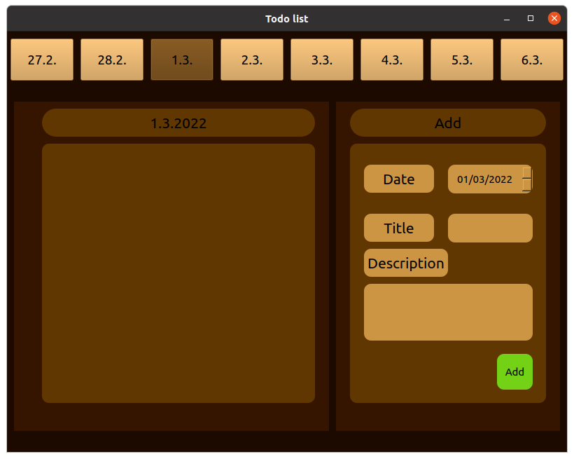

# Todo list

## Virtual environment

In project directory
- Create
    ```
    virtualenv env
    ```
- Start
    - 1st option
        ```
        source env/bin/activate
        ```
    - 2nd option
        ```
        source env/Scripts/activate
        ```
- Install requirements
    ```
    pip intall -r requirements.txt
    ```


## Start

In project directory
```
python main.py
```

## Visual


